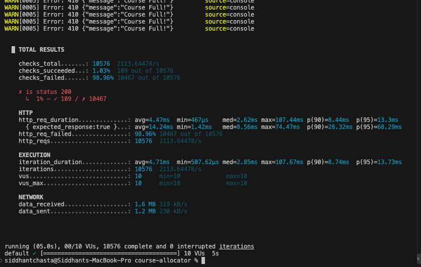
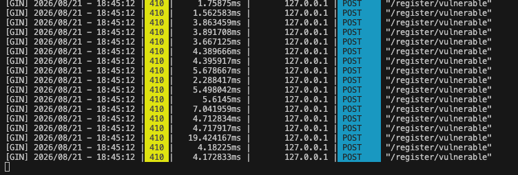
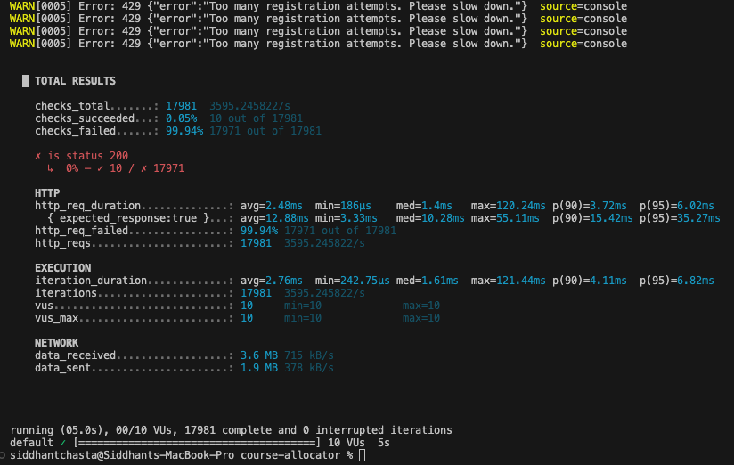
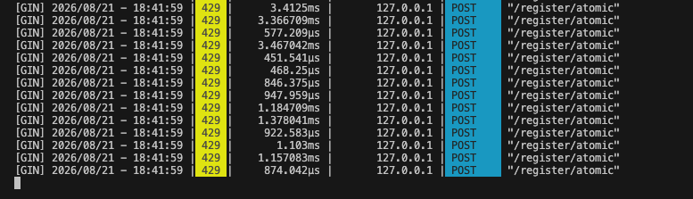

# Concurrent Course Allocator: High-Concurrency Registration Engine

**Concurrent Course Allocator** is a backend system designed to simulate a high-traffic university course registration portal during peak add/drop periods. The goal of this project is to demonstrate, diagnose, and solve **distributed race conditions** that occur when thousands of students contend for limited course seats simultaneously, while also protecting the infrastructure from bot abuse.

## 🌟 Key Features

1. **Distributed Concurrency Control:** Bypasses vulnerable database transactions by moving the "check-and-decrement" hot path to Redis Lua scripts, guaranteeing atomic seat allocation.
2. **Anti-Bot Rate Limiting:** Implements a distributed Token Bucket algorithm via custom Go middleware to block abusive traffic spikes (HTTP 429) before they reach the database.
3. **Dynamic Credit Pricing:** An inventory-aware algorithm that reads from a high-speed cache to dynamically recalculate course credit requirements in real-time as seats become scarce.

## 🏗️ Architecture & Tech Stack

* **Language:** Go (Golang 1.25)
* **Framework:** Gin (HTTP Web Framework)
* **Database:** PostgreSQL (Persistence)
* **Caching/Locking:** Redis + Lua Scripting (Atomic Counters & Rate Limiting)
* **Infrastructure:** Docker & Docker Compose
* **Testing:** K6 (Load Testing)

## 📂 Project Structure

Refactored to follow the **Standard Go Project Layout** for maintainability and scalability.

```text
course-allocator/
├── cmd/
│   └── server/
│       └── main.go        # Application entry point (Wires Repos, Handlers, Middleware)
├── internal/
│   ├── handlers/          # HTTP Layer: Handles Registration & Pricing (Gin)
│   ├── middleware/        # Security Layer: Token Bucket Rate Limiter
│   └── repository/        # Data Layer: Postgres Queries & Redis Lua Scripts
├── docker-compose.yml     # Infrastructure (DB + Cache)
└── go.mod                 # Dependencies
```

## 🚀 Getting Started

### 1. Infrastructure Setup

The system uses Docker to manage the database and cache, ensuring a clean environment.

```bash
docker-compose up -d
```

### 2. Booting the Server

Start the Go backend using the following command.

```bash
go run cmd/server/main.go
```

Reset the demo inventory and simulate a registration. Run in a different terminal:

```bash
curl -X POST http://localhost:9090/reset
curl -X POST http://localhost:9090/register/vulnerable
curl -X POST http://localhost:9090/register/atomic
```

The initial implementation uses a naive **Read → Check → Modify** strategy in PostgreSQL:

- Read current seats from PostgreSQL.
- Check if `seats > 0`.
- Update the database with `seats = seats - 1`.

While logical for a single user, this approach is **not atomic** under high concurrency. To prove the vulnerability, K6 simulates a traffic spike with 10 virtual users hitting the endpoint simultaneously for 5 seconds.

## Phase 1: The Vulnerable Implementation & The Exploit

### The Result: Overselling (Data Corruption)

The system fails to maintain data integrity. Despite having a hard limit of **100 seats**, the system successfully processed **107 registrations**.

- **Total Requests Processed:** 10,576 requests
- **Successful Allocations (200 OK):** 109
- **Oversold Anomaly:** +9 seats (9% overbooking)



The server logs during the same run show the expected `410 Course Full` responses once the inventory is exhausted:



The 9 extra seats are allocated because multiple goroutines read the same stock count at the exact same microsecond before any of them could commit the decrement transaction to disk.

## Phase 2: The Solution (Redis + Lua)

To fix the race condition, the inventory state management was migrated to **Redis**. Instead of a database transaction, the check-and-decrement logic is executed using a Redis Lua script.

- **Atomicity:** Redis guarantees that a Lua script executes as a single, indivisible operation.
- **Performance:** In-memory operations eliminate the database I/O bottleneck.

```lua
local seats = tonumber(redis.call("GET", KEYS[1]))
if seats > 0 then
    redis.call("DECR", KEYS[1])
    return 1 -- Success
else
    return 0 -- Course Full
end
```

### The Result: Perfect Consistency

Running the K6 attack against the atomic Redis endpoint (`/register/atomic`):

- **Total Requests Processed:** 17,981 requests
- **Successful Allocations (200 OK):** 100
- **Oversold Seats:** 0 (exact match)



## Anti-Bot Rate Limiting (Token Bucket)

To protect the registration endpoint from automated bot abuse, a **Token Bucket Rate Limiter** was implemented using custom Gin middleware and a Redis Lua script.

When simulating a bot attack from a single IP address, the middleware intercepts and drops aggressive traffic with an `HTTP 429 Too Many Requests` response, using less than 2 ms of processing time and zero database I/O.

The corresponding Gin server logs confirm the `429` responses on `/register/atomic`:



## Design Choices & Challenges

- **Go (Golang) over Node/Python:** Chosen for its native concurrency support and low-latency execution, which is critical for high-frequency registration systems.
- **Redis Lua Scripting vs. Database Locking:**
  - _Option A (Rejected):_ PostgreSQL row locking (`SELECT ... FOR UPDATE`) guarantees safety but serializes requests, reducing throughput.
  - _Option B (Chosen):_ Redis Lua scripting moves the hot path to memory. Since Redis is single-threaded and Lua scripts are atomic, the system achieves perfect safety without the disk I/O penalty.
- **Fail-Open Security Strategy:** If Redis temporarily goes down, the rate-limiting middleware allows traffic to proceed to the database rather than dropping all user requests.
- **Preventing "Self-DDOS" (Connection Exhaustion):** Initially, simulating hundreds of concurrent students crashed PostgreSQL with `pq: sorry, too many clients`. This was solved by implementing connection pooling with `db.SetMaxOpenConns(25)` at the Go application layer to safely queue requests.


